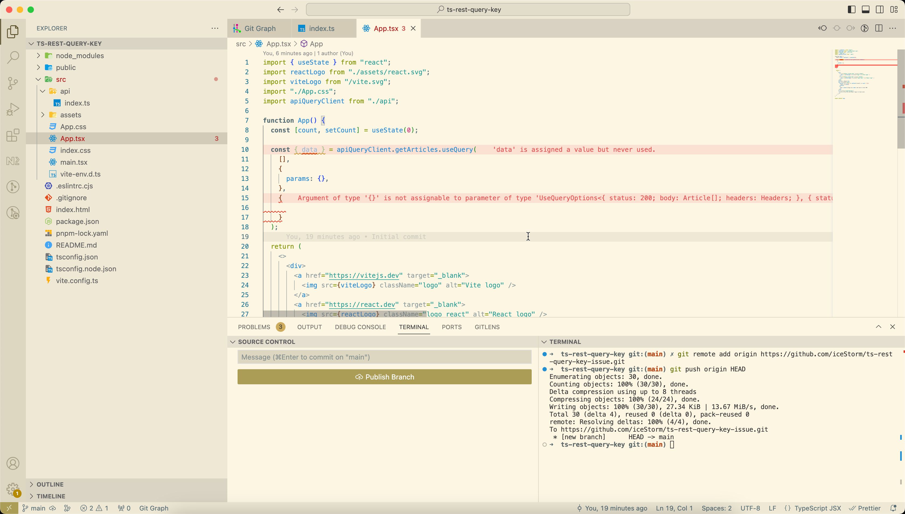
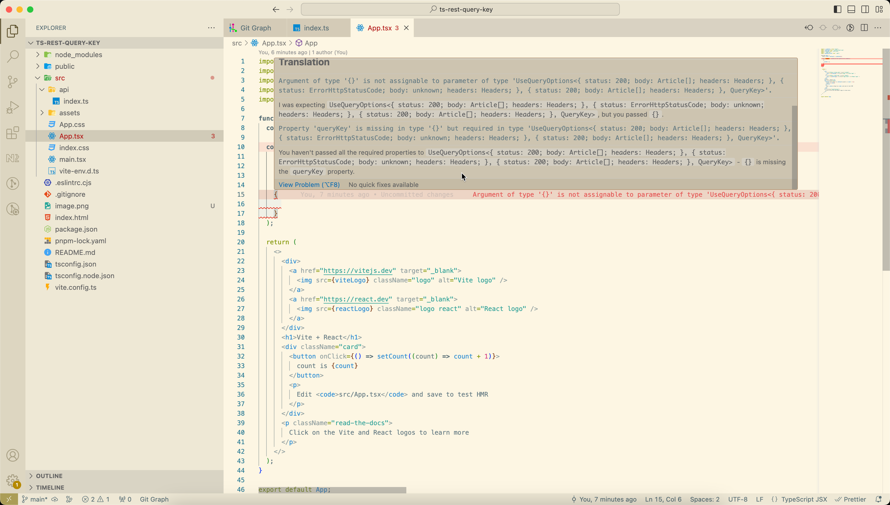

### @ts-rest/react-query queryKey issue

### contract and initQueryClient:
```TypeScript
import { initContract } from "@ts-rest/core";
import { initQueryClient } from "@ts-rest/react-query";

const contract = initContract();

export interface Article {
  id: string;
  title: string;
}

const appRouter = contract.router({
  getArticles: {
    method: "GET",
    path: "/articles",
    responses: {
      200: contract.type<Article[]>(),
    },
  },
});

const apiQueryClient = initQueryClient(appRouter, {
  baseHeaders: {},
  baseUrl: "",
});

export default apiQueryClient;
```

### useQuery usage:


### error:

